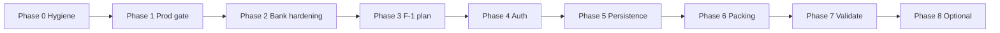

# Post–Bank Release Plan (Excludes F-2 Multi-Trip)

**Created:** 2026-06-02  
**Scope:** Close bank release gaps, production verification, repo hygiene, and **F-1 User Login & Layered Persistence**.  
**Out of scope:** F-2 Multi-Trip Workspaces, self-service auth, cross-device sync, OAuth.

**Canonical references:**
- Bank tasks: `.specify/bank_tasks.md` (all complete)
- F-1 spec: `specs/001-user-login-persistence/spec.md`
- Verification: `verification_plan.md`
- Backlog: `BACKLOG.md`

---

## Overview

| Phase | Name | Goal | Est. effort |
|-------|------|------|-------------|
| 0 | Hygiene & docs | Commit pending specs; sync branches; trim doc drift | 0.5 day |
| 1 | Production gate | Vercel deploy verified + live smoke | 0.5 day |
| 2 | Bank hardening | Close spec/code gaps (locking, PlaceCard, rate limit) | 1–2 days |
| 3 | F-1 design | `/speckit-plan` → `plan.md`, `tasks.md` | 0.5–1 day |
| 4 | F-1 auth & session | Sign-in/out, session gate, roster | 2–3 days |
| 5 | F-1 persistence | Group vs personal storage slices | 3–4 days |
| 6 | F-1 packing & migration | Common/personal lists + anonymous upgrade | 2–3 days |
| 7 | F-1 validation | Unit + E2E + prod smoke | 1 day |
| 8 | Optional backlog | Transit routing, push alerts (only if needed) | TBD |

**Total (Phases 0–7):** ~11–15 dev days solo.

---

## Phase 0 — Hygiene & documentation

**Goal:** Single source of truth on `main`; no “hidden” uncommitted scope.

### Tasks
- [ ] Commit local spec/backlog edits:
  - `specs/001-user-login-persistence/spec.md`
  - `specs/001-user-login-persistence/checklists/requirements.md`
  - `.specify/user_login_persistence.md`
  - `BACKLOG.md`
- [ ] Sync `origin/feat/bank-itinerary` to `main` (or delete remote feature branch after confirming `main` is canonical).
- [ ] Delete or archive remote `feat/step-14-15-polishes` (already merged).
- [ ] Update `CHANGELOG.md` [Unreleased] with hygiene + plan reference.
- [ ] Mark stale `.specify/step_14_*` / `step_15_*` checklists as **superseded** (or move to `docs/archive/`).

### Exit criteria
- `git status` clean on `main`.
- Only `main` + one active feature branch policy documented in `BACKLOG.md`.

---

## Phase 1 — Production gate

**Goal:** Confirmed live deployment matches `main` HEAD.

### Prerequisites
- Vercel GitHub App has access to `lachtomer/TripiAgent`.
- Production branch = `main`.
- Env vars set: `GEMINI_API_KEY`, `GOOGLE_PLACES_API_KEY`, `OPENWEATHER_API_KEY`, `GEMINI_MODEL`, `TRIP_REGION`.

### Tasks
- [ ] Confirm latest Production deployment commit (target: post–`a56f8c8` or newer).
- [ ] Run `verification_plan.md` manual smoke on production URL:
  - `/`, `/chat`, `/itinerary`, `/pack`, `/admin/bank`
  - Hebrew RTL toggle
  - Bank generate → submit
  - Home bookmark → itinerary saved list
- [ ] Bundle grep on production build artifact (no `GEMINI_` / `GOOGLE_` / `OPENWEATHER_` in client static).
- [ ] Record results in `verification_plan.md` (date + commit SHA).

### Exit criteria
- Production URL smoke **PASS** documented.
- No blocking env or 5xx on core routes.

---

## Phase 2 — Bank hardening (spec/code gaps)

**Goal:** Align shipped bank with `.specify/bank.md` or explicitly defer with backlog entries.

### 2a — Optimistic locking (recommended for multi-admin)
**Spec:** `.specify/bank.md` §9

- [ ] Add `.specify/bank_optimistic_locking.md` (implementation spec) if not folding into plan tasks.
- [ ] Versioned `data/bank.json` shape: `{ version, places }`.
- [ ] API: `GET` returns version; `POST`/`DELETE` require `expectedVersion`; `409` on conflict.
- [ ] `bankStore`: track version, refresh on `409`, user message.
- [ ] Unit tests for conflict path; optional E2E mock stale version.

### 2b — PlaceCard / pre-book (task 4.6 gap)
**Current:** Category badges on admin preview only; no `components/PlaceCard.tsx`.

- [ ] Decide: implement shared `PlaceCard` for saved/bank surfaces **or** update `task.md` / `bank.md` to match admin-only preview.
- [ ] If implementing: `PlaceCard` with category badge + pre-book CTA (`#006400`, 48px tap targets).
- [ ] Wire into saved attractions or bank list as product dictates.

### 2c — Rate limiting
**Spec risk:** `.specify/bank.md` §10

- [ ] Apply existing global rate-limit middleware to `/api/bank/places` and `/api/bank/parse`.
- [ ] Unit test: over-limit returns expected status.

### Exit criteria
- Either all 2a–2c done **or** each deferred item has a `BACKLOG.md` row with owner/date.
- `npm run lint && npm run test && npm run test:e2e && npm run build` green.

---

## Phase 3 — F-1 design (Spec Kit)

**Goal:** Actionable `plan.md` + `tasks.md` under `specs/001-user-login-persistence/`.

### Tasks
- [ ] Run `/speckit-plan` from `specs/001-user-login-persistence/spec.md`.
- [ ] Resolve planning decisions (document in plan):
  - **Common packing check-off:** per-user on common items (spec default).
  - **Storage v1:** Zustand persist keys split by slice (group trip id = single `"default"` trip in v1).
  - **Credentials v1:** static roster in server config or `data/accounts.json` (no self-registration).
  - **Concurrent itinerary edits:** last-write-wins + toast (spec edge case).
- [ ] Run `/speckit-tasks` → ordered `tasks.md`.
- [ ] Optional: `/speckit-checklist` for release gate.

### Exit criteria
- `specs/001-user-login-persistence/plan.md` and `tasks.md` exist and trace to FR-1…FR-20.

---

## Phase 4 — F-1 auth & session

**Goal:** Replace profile switcher with real sign-in gate (FR-1…FR-5, FR-15…FR-18).

### Tasks
- [ ] Sign-in route or full-screen gate (`/login` or modal) before app routes.
- [ ] Server-side credential check (minimal API: `POST /api/auth/login`, `POST /api/auth/logout`).
- [ ] Session cookie or signed token (httpOnly, secure in prod).
- [ ] Remove or hide anonymous trip access when unauthenticated.
- [ ] Sign-out clears session + in-memory stores.
- [ ] Chrome shows active user (FR-5).
- [ ] Rate-limit / delay failed logins (FR-17).
- [ ] Bind `lib/bankPermissions.ts` to signed-in admin session, not display-name picker alone.

### Exit criteria
- SC-5, SC-6 met in dev.
- E2E: invalid login rejected; valid login reaches home.

---

## Phase 5 — F-1 persistence model

**Goal:** Group-shared vs per-user data slices (FR-6…FR-8, FR-13…FR-14).

### Storage layout (v1, same device)
| Slice | Keys / store | Contents |
|-------|----------------|----------|
| Group trip | `tripiagent-group-*` | itinerary, saved bank, trip dates, mode, group chat |
| Personal | `tripiagent-user-{id}-*` | locale, personal bank signals, activity-done map |
| Session | memory + cookie | `currentUserId` |

### Tasks
- [ ] Refactor `tripStore` (or split stores): group vs personal selectors.
- [ ] Itinerary + saved attractions = group (FR-6).
- [ ] Auto-save group edits; visible after sign-in switch (FR-8).
- [ ] Locale per signed-in user (FR-13).
- [ ] Per-user activity completion on shared itinerary (FR-14).
- [ ] Unit tests for isolation: Tomer edit ≠ Liran personal slice.

### Exit criteria
- SC-1 met: two users see same itinerary after either edits.

---

## Phase 6 — F-1 packing & migration

**Goal:** Common + personal packing (FR-9…FR-12) and upgrade path (FR-19…FR-20).

### Tasks
- [ ] Split packing model: `commonItems[]`, `personalItemsByUserId`.
- [ ] UI: “Trip essentials (group)” vs “My packing” sections on `/pack`.
- [ ] FR-10: per-user check-off on common items (document in UI copy).
- [ ] FR-11: personal list hidden for other users.
- [ ] One-time migration modal: attach anonymous `tripiagent-trip-storage` to group + current user personal slice (FR-19).
- [ ] New account → default empty group trip (FR-20).

### Exit criteria
- SC-2, SC-3, SC-4 met.
- E2E: sign-in as Tomer → personal item → sign-in as Liran → item not visible.

---

## Phase 7 — F-1 validation & release

**Goal:** Same bar as bank release.

### Tasks
- [ ] Vitest: auth API, store slices, migration helper.
- [ ] Playwright: `e2e/auth/login_persistence.smoke.spec.ts` (scenarios 1–4 from spec §2).
- [ ] Full pipeline: `lint` → `test` → `test:e2e` → `build`.
- [ ] Update `README.md`, `DESIGN.md`, `HANDOFF.md` for login flows.
- [ ] Production smoke (sign-in, switch user, packing isolation).
- [ ] Mark FR checkboxes in spec or link to `tasks.md` completion.

### Exit criteria
- All Phase 7 tests green.
- `BACKLOG.md` F-1 row → **Done**.

---

## Phase 8 — Optional (post F-1, not F-2)

Only if product priority demands; otherwise leave in `BACKLOG.md`.

| Item | Notes |
|------|--------|
| Live transit routing | Google Routes / Trenitalia — new spec required |
| Push notifications | Rain, ZTL, flight — PWA + backend worker; new spec |

---

## Dependency graph

**Parallel allowed:** Phase 0 + Phase 1 (partial). Phase 2 can start after Phase 1 smoke passes.

---

## What is explicitly NOT in this plan

- **F-2** Multi-trip workspaces (separate `/speckit-specify` when ready).
- Cross-device sync, OAuth, password reset email.
- Full PostgreSQL bank migration (documented in `.specify/bank_prod_readiness.md`; implement when scale requires).

---

## Suggested execution order (YOLO-friendly)

1. Phase 0 → commit → push `main`
2. Phase 1 → confirm Vercel production
3. Phase 2a only if multiple admins edit bank concurrently; else defer 2a to backlog
4. Phases 3–7 sequentially for F-1
5. Phase 8 only on explicit request

---

*Update this file when a phase completes; link commit SHAs in `CHANGELOG.md`.*
