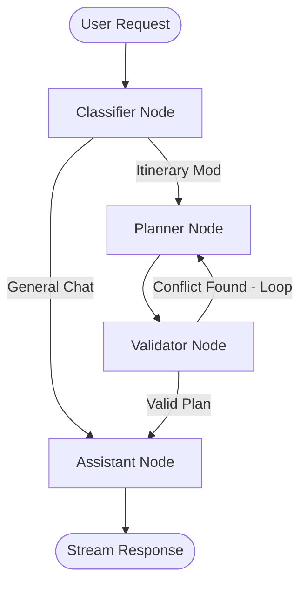

# Specification: Step 4b — LangGraph Adoption in Agent Workflows

This specification defines the functional architecture for integrating LangGraph.js into the **TripiAgent** execution workflow, replacing simple single-prompt routing with a stateful, cyclic agent graph.

## 1. Goal & Context
Transition the travel planning assistant from a single-prompt execution model to a controllable state machine. This enables the agent to check conditions (weather, ZTL driving schedules, budget) iteratively, looping back to re-plan if rules are violated before presenting final options.

## 2. Core Graph Design

We will implement a cyclic execution graph consisting of four specialized nodes:

### 2.1 State Schema (`AgentState`)
The shared memory graph state stores:
- `messages`: List of chat messages (user/agent inputs).
- `itinerary`: Current active daily plan.
- `location`: Coordinate and city context.
- `conflicts`: Array of validation flags (ZTL warnings, ferry schedule mismatches, bad weather events).

### 2.2 Specialized Nodes
1.  **Classifier Node:** Parses user intent. Routes to `Assistant Node` for general chat, or to `Planner Node` if the user is asking to add, delete, or change travel activities.
2.  **Planner Node:** Updates the itinerary slots using Gemini 2.5 Flash.
3.  **Validator Node:** A rule-based execution node that runs ZTL checks, ferry timeline queries, and weather forecast matches. If a constraint is violated (e.g. driving in Milan ZTL during active hours without marking it paid), it appends a conflict to the state and triggers a loop back to the `Planner Node`.
4.  **Assistant Node:** Formulates the final conversational response, packaging the text explanations and structural before/after changes.

## 3. UI & Form Factor Constraints
- Graph execution occurs server-side in Next.js edge/server routes.
- The UI retains its append-only confirm state: proposed changes generated by the graph are displayed in the Before/After drawer.

## 4. Security & Edge Cases
- **Loop Limits:** To prevent infinite execution loops during planning, the graph validator enforces a maximum recursion count of 3. If exceeded, it drops back to the assistant with warnings.
- **Fail-safe Fallback:** If graph execution crashes, default back to standard single-prompt LLM routing.
