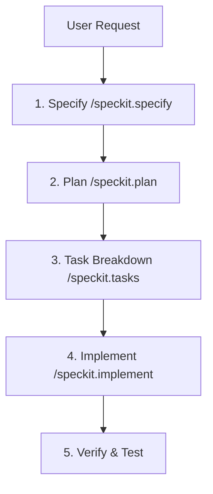

# Spec-Driven Development (SDD) — Ways of Working

This document defines the ways of working for developers and AI agents (Antigravity, Cursor, Copilot) when modifying or extending the **TripiAgent** travel assistant.

---

## 1. The SDD Lifecycle

Every feature, optimization, or bug fix must move through a structured specification-driven lifecycle before any code is modified.

### Phase 1: Specify (`/speckit.specify`)
*   **Action:** Define *what* we want to build, *why*, and *how* it behaves from the user's perspective.
*   **Artifact:** Create or update a markdown specification file under `.specify/<feature_name>.md` or `specs/<N>-<feature-name>/spec.md`.
*   **Constraint:** Zero implementation code may be written during this phase.

### Phase 2: Plan (`/speckit.plan`)
*   **Action:** Derive a technical architecture and design document based on the approved specification.
*   **Artifact:** Write or update `implementation_plan.md` or `.specify/plans/<feature_name>_plan.md`.
*   **Constraint:** The plan must identify dependencies, file modifications, state changes, API contracts, and security rules.

### Phase 3: Task Breakdown (`/speckit.tasks`)
*   **Action:** Decompose the approved technical plan into a logical, ordered checklist of tasks.
*   **Artifact:** Write or update `task.md` or `.specify/tasks/<feature_name>_tasks.md`.
*   **Constraint:** Tasks must map out step-by-step implementations with unit and E2E test requirements.

### Phase 4: Implement (`/speckit.implement`)
*   **Action:** Implement the tasks sequentially, requesting human confirmation at each sub-step.
*   **Constraint:** The agent must only edit files specified in the plan and check off tasks in the checklist.

---

## 2. Command Reference for AI Agents

When interacting with the AI agent, use the following slash commands to drive the SDD process:

| Command | Purpose | Action Performed |
| :--- | :--- | :--- |
| `/speckit.constitution` | Print or align with project rules. | Reads and reviews `.specify/constitution.md` to align agent parameters. |
| `/speckit.specify` | Create/edit functional specs. | Drafts or modifies the spec file under `.specify/` and asks for user confirmation. |
| `/speckit.plan` | Plan architectural changes. | Drafts technical plan and files list, including Zod schema validation & DB contracts. |
| `/speckit.tasks` | Break down work into tasks. | Generates task lists, test requirements, and saves them to `task.md`. |
| `/speckit.implement` | Execute planned coding work. | Executes code edits one file and one step at a time. |

---

## 3. Strict Rules for AI Coding Agents

1.  **Specification Guard:** If a user prompts you to write code, add a feature, or edit routes, you must first check if a corresponding specification file exists in `.specify/` (or `specs/`). If it does not exist, you must **refuse to write code** and ask the user to run `/speckit.specify` to draft the spec.
2.  **No In-Flight Divergence:** Do not add extra features or make structural changes that are not documented in the active spec. If changes are needed, update the specification and plan first, obtain user confirmation, and then modify the code.
3.  **One Step at a Time:** Pause after each file change or sub-task to report progress (list of modified files and command/test output) and wait for the user's explicit `"confirmed"` before moving to the next task.
